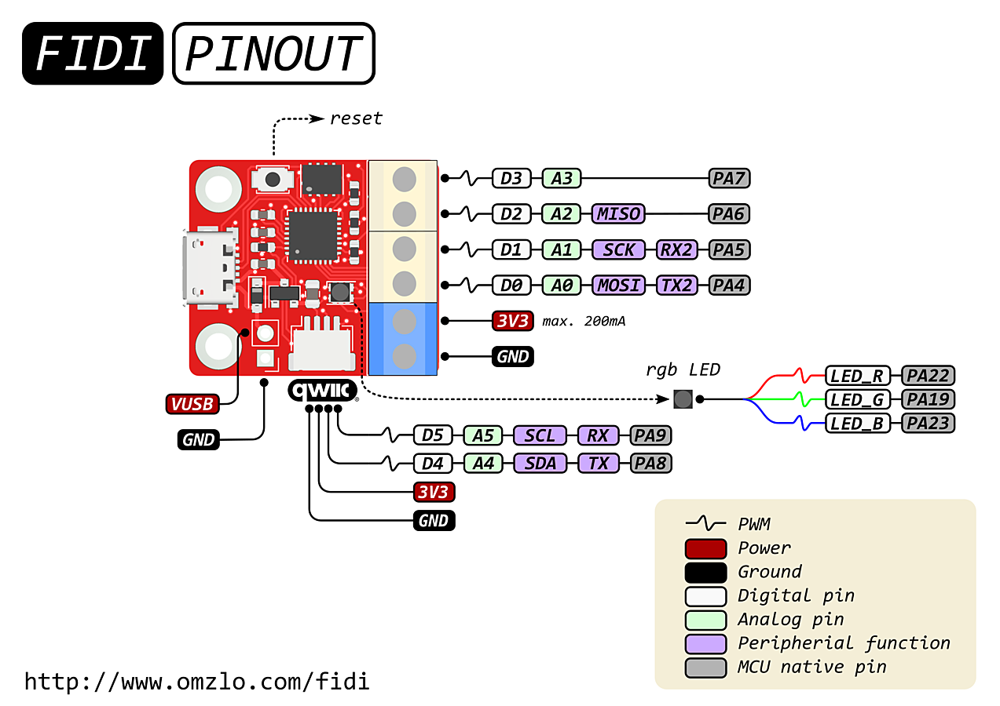

# *CircuitPython* on the Omzlo FIDI Board
## Omzlo FIDI

### Technical details
* Small!: it measures 25.4mm x 22mm (1" x 0.86")
* Microchip ATSAMD21E18A 32-bit Arm Cortex M0+ running at 48MHz, with 256KB flash, and 32KB RAM
* 4MB flash for *CircuitPython* code and other files
* Six GPIOs, featuring SPI, I2C, UART, Digital/Analog IO, PWM, ...
* 3.5mm terminal block connectors and one 4 pin *QWIC/STEMMA QT* connector
* 3.3V logic level, maximum 200mA
* USB micro connection to PC
* User-controlled RGB LED

## Introduction
The [Omzlo: FIDI](https://www.omzlo.com/articles/fidi-a-tiny-board-for-super-fast-prototyping-with-circuitpython) is quite attractive for prototyping due to its size, cost and relative power. It is based on the ATSAMD21 microcontroller which is an ARM M0+-based chip. Due to its specs, you can easily and quickly program it using *CircuitPython* (or *MicroPython*). In my case, I'll be using *CircuitPython* to take advantage of a number of Adafruit boards. You will want to install the latest  using [CircuitPython Serpente](https://circuitpython.org/board/serpente/) and also get the latest [CircuitPython Library Bundle](https://circuitpython.org/libraries).

## Applications (*run as code.py*)
* **ultra_fixed:** provides three fixed frequencies (500, 22kHz, 40kHz)
    Uses namedtuple instances to identify states, parameters are:
    state: current state
    onSTEP: state to move to based on press of STEP button
    onENTER: state to move to based on press of ENTER button

    Example:
    state_1 = states(1, 2, 4)


* **ultra_random:** provides two fixed frequencies (500, 40kHz) and a random
    Uses namedtuple instances to identify states, parameters are:
    state: current state
    onSTEP: state to move to based on press of STEP button
    onENTER: state to move to based on press of ENTER button

    Example:
    state_1 = states(1, 2, 4)

    Requires:
        ultra.py -> code.py
        lib:
            adafruit_ticks.mpy
            adafruit_debouncer.mpy
            proto_buttons.mpy
            RGB_LED.mpy

## Library Files
**RGB_led:** 
```python
from RGB_led import rgb

rgb('b') 	# lights only blue led
rgb('gb') 	# lights both green and blue led
rgb('rgbn')	# does nothing, too many letters
rgb('')		# turns all leds off
```
**proto_buttons:**
```python
from proto_buttons import buttons

pressed = buttons()
if pressed != None:
    if pressed == "D0":
        count_UP += 1
        print(f"{count_UP =}")
        rgb('gb')
    elif pressed == "D1":
        count_ENTER += 1
        print(f"{count_ENTER =}")
        rgb('b')

    else:
        rgb('r')

```

## Using Library Files (lib/)
It's best to load the Library files using the mpy versions as they are smaller and faster to load. To do so, do the following:
```bash
mpy lib/filename.py
cp -X lib/filename.mpy /Volumes/CircuitPython/lib
```
## Example files
**analog_in:**
Demonstrates how to use analog input using a context manager. Not required for a small program, however, useful to use as it will release the pin per *CircuitPython* requirements.

**button_counter:**
Demonstrates how to use *proto_buttons buttons()*, sets up two buttons using the protoboard and counts each press, printing values over USB

**fsm:**
Simple, four state, finite state machine (fsm), implemented using a namedtuple. I used a namedtuple to identify the required parameters for the fsm. See file for more details.

**pwm:**
Example for pwm from Adafruit.

**rgb_blink:**
Shows how to blink any one of the three color leds.

**rgb_input:**
Handy example to enter *"r|g|b"* to see what color the combinations make. Uses USB port. Provides function rgb('r|g|b') to turn RGB led on or off. Any combination of *'rgb'* may be provided and for each letter, the appropriate led will turn on. If not provided, the appropriate led will be off.

## Utilities
**mpl.sh**
Copy file to preferred folder *(in my case, \~/bin)* and add to the build process. This will create a .mpy version of the file being edited and will copy it to the lib folder under CircuitPython. 